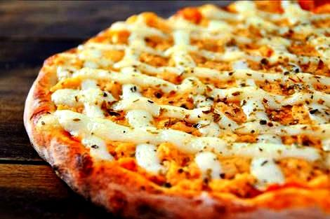

# 🍕 Gran Pizza - Landing Page

Landing Page fictícia para a pizzaria **Gran Pizza**, criada com HTML, CSS e JavaScript.  
O objetivo do projeto é simular um site moderno e responsivo para delivery de pizzas artesanais, com cardápio interativo, promoções e integração direta com o WhatsApp.

👉 **Acesse o projeto online:** [Gran Pizza - GitHub Pages](https://tainamartins20.github.io/)

---

## 📸 Screenshots

### Página Inicial


### Cardápio Dinâmico


### Promoções Especiais



---

## 🚀 Funcionalidades

- **Hero Section** com destaque para a chamada principal e botões de ação.  
- **Cardápio dinâmico** carregado via JavaScript, com filtros de categoria (Mais Vendidas, Promoções, Especiais, Todas).  
- **Promoções especiais** com destaque para combos e descontos.  
- **Botão flutuante do WhatsApp** para realizar pedidos de forma rápida.  
- **Animações suaves** ao rolar a página e interação nos elementos.  
- **Design 100% responsivo** adaptado para desktop, tablets e mobile.  

---

## 🛠️ Tecnologias Utilizadas

- **HTML5** → Estrutura semântica da página  
- **CSS3** → Estilização moderna com variáveis, grid, flexbox e animações  
- **JavaScript (ES6+)** → Dinâmica do cardápio, filtros, integração com WhatsApp e interatividade  
- **Font Awesome** → Ícones  
- **Google Fonts (Poppins)** → Tipografia  

---

## 📂 Estrutura de Pastas

```bash
gran-pizza-landing-page/
├── index.html
├── assets/
│   ├── css/
│   │   └── styles.css
│   ├── js/
│   │   └── script.js
│   └── img/
│       ├── hero-img.jpg
│       ├── pizza1.jpg
│       ├── pizza2.jpg
│       └── ...
📦 Como Usar
Clone este repositório:

bash
Copiar código
git clone https://github.com/tainamartins20/gran-pizza.git
Acesse a pasta do projeto:

bash
Copiar código
cd gran-pizza
Abra o arquivo index.html no navegador.

🎯 Melhorias Futuras
Implementar formulário de contato.

Adicionar integração real com sistema de pedidos.

Criar painel administrativo para gerenciar o cardápio.

👩‍💻 Autor(a)
Projeto desenvolvido por Taina Martins 🚀
